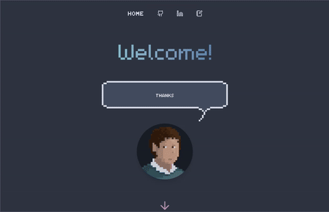

# Practice WASM & Leptos

This repository contains a simple Rust WASM frontend project to practice using the Leptos library.

## Demo



## Attribution

- [RETRO_SPACE](https://opengameart.org/content/font-retrospace) font (CC0) by Daniel Michel
- [m5x7](https://managore.itch.io/m5x7) font (CC0) by Daniel Linssen

## How to develop

### Start

Make sure you have run:

  ```shell
  cargo install trunk leptosfmt
  ```

To start, run the following command (and open `localhost:8080` in your browser, if it doesn't open automatically):

  ```shell
  trunk serve --open
  ```

To deploy, run:

  ```shell
  trunk build --release
  ```

Then use the files in the `dist` folder with any static site host to serve these files.

### Using Nix Flakes, JetBrains RustRover & Direnv

You can run this project in any way you like, but I have set things up to make it easy to develop using JetBrains
RustRover. For this, you'll need:

- `direnv`
- Any Direnv integration plugin e.g. https://plugins.jetbrains.com/plugin/15285-direnv-integration
- `nix`

This way, you'll just need to `direnv allow` in the project directory after which all prerequisites (incl. Rust, Cargo,
all Bevy dependencies, etc.) will be available to you. The JetBrains plugin will ensure that the environment is
available to your IDE and you can run the project from there (vs `cargo build` and `cargo run` in the terminal).

### Using Nix Flakes

Without `direnv`, you can use the Nix Flake by running `nix develop` in the project directory. If you want to use an IDE
such as JetBrains RustRover, you'll have to set up the environment manually.

Upgrade the flake by running `nix flake update` in the repository's base directory.

### Reminders

#### Run configurations

- Run formatter with:
    ```shell
    leptosfmt ./**/*.rs
    ```
